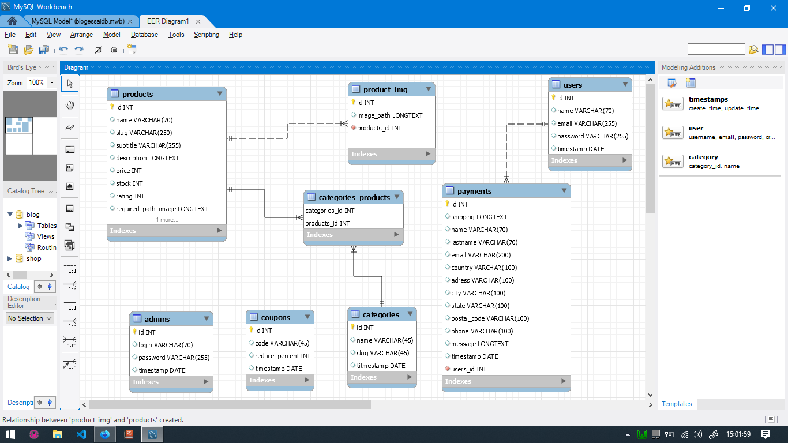

# General
This repo is about modelisation of ecommerce database.I stored products(with their image),categories,users,
admins,coupons(for promotion),and users's payments.


## My tables
So there are my tables with datails:
* Products
* Categories
* Users
* Coupons
* Admins
* Payments
* Product_img
* Categories_product

#### Products table
I store all products information in this table with also the path of product's required image
* id
* name
* slug
* subtitle
* description
* price
* stock
* rating
* required_path_image
* timestamp

#### Categories table
I store all categories of product in the shop
* id
* name
* slug
* timestamp

#### Users table
I store all users of the shop
* id
* name
* email
* password
* timestamp

#### Coupons table
I store all coupon code of the shop 
* id
* code
* reduce_percent
* timestamp

#### Admins table
I store all admins of the shop they can add/delete products,coupons,categories and others administration action 
* id
* login
* password
* timestamp

#### Payments table
I store all users's payments information with the cart content in json format.There is a '__one to many__' relashionship between payments and users so i also store user id in this table
* id
* user_id
* shipping
* name
* lastname
* email
* country
* adress
* city
* state
* postal_code
* phone
* message
* timestamp

#### Product_img table (additionnal image)
I store all additional product image with the product id in order to access them with models relashionship ('__one to many__')
* id
* image_path
* products_id
* timestamp

#### Categories_products table (additionnal image)
There is '__many to many__' relashionship between products and categories so in this table I simply store product id and it's category id
* id
* category_id
* products_id

# Deployment code of first database migration
You can download shop.sql file

```sql
-- MySQL Script generated by MySQL Workbench
-- Mon Sep  6 15:26:01 2021
-- Model: New Model    Version: 1.0
-- MySQL Workbench Forward Engineering

SET @OLD_UNIQUE_CHECKS=@@UNIQUE_CHECKS, UNIQUE_CHECKS=0;
SET @OLD_FOREIGN_KEY_CHECKS=@@FOREIGN_KEY_CHECKS, FOREIGN_KEY_CHECKS=0;
SET @OLD_SQL_MODE=@@SQL_MODE, SQL_MODE='ONLY_FULL_GROUP_BY,STRICT_TRANS_TABLES,NO_ZERO_IN_DATE,NO_ZERO_DATE,ERROR_FOR_DIVISION_BY_ZERO,NO_ENGINE_SUBSTITUTION';

-- -----------------------------------------------------
-- Schema shop
-- -----------------------------------------------------

-- -----------------------------------------------------
-- Schema shop
-- -----------------------------------------------------
CREATE SCHEMA IF NOT EXISTS `shop` DEFAULT CHARACTER SET utf8 ;
-- -----------------------------------------------------
-- Schema shop
-- -----------------------------------------------------

-- -----------------------------------------------------
-- Schema shop
-- -----------------------------------------------------
CREATE SCHEMA IF NOT EXISTS `shop` DEFAULT CHARACTER SET utf8 ;
USE `shop` ;

-- -----------------------------------------------------
-- Table `shop`.`admins`
-- -----------------------------------------------------
CREATE TABLE IF NOT EXISTS `shop`.`admins` (
  `id` INT NOT NULL AUTO_INCREMENT,
  `login` VARCHAR(70) NULL,
  `password` VARCHAR(255) NULL,
  `timestamp` DATE NULL,
  PRIMARY KEY (`id`))
ENGINE = InnoDB;


-- -----------------------------------------------------
-- Table `shop`.`users`
-- -----------------------------------------------------
CREATE TABLE IF NOT EXISTS `shop`.`users` (
  `id` INT NOT NULL AUTO_INCREMENT,
  `name` VARCHAR(70) NULL,
  `email` VARCHAR(255) NULL,
  `password` VARCHAR(255) NULL,
  `timestamp` DATE NULL,
  PRIMARY KEY (`id`))
ENGINE = InnoDB;


-- -----------------------------------------------------
-- Table `shop`.`products`
-- -----------------------------------------------------
CREATE TABLE IF NOT EXISTS `shop`.`products` (
  `id` INT NOT NULL AUTO_INCREMENT,
  `name` VARCHAR(70) NULL,
  `slug` VARCHAR(250) NULL,
  `subtitle` VARCHAR(255) NULL,
  `description` LONGTEXT NULL,
  `price` INT NULL,
  `stock` INT NULL,
  `rating` INT NULL,
  `required_path_image` LONGTEXT NULL,
  `timestamps` DATE NULL,
  PRIMARY KEY (`id`))
ENGINE = InnoDB;


-- -----------------------------------------------------
-- Table `shop`.`categories`
-- -----------------------------------------------------
CREATE TABLE IF NOT EXISTS `shop`.`categories` (
  `id` INT NOT NULL AUTO_INCREMENT,
  `name` VARCHAR(45) NULL,
  `slug` VARCHAR(45) NULL,
  `titmestamp` DATE NULL,
  PRIMARY KEY (`id`))
ENGINE = InnoDB;


-- -----------------------------------------------------
-- Table `shop`.`coupons`
-- -----------------------------------------------------
CREATE TABLE IF NOT EXISTS `shop`.`coupons` (
  `id` INT NOT NULL AUTO_INCREMENT,
  `code` VARCHAR(45) NULL,
  `reduce_percent` INT NULL,
  `timestamp` DATE NULL,
  PRIMARY KEY (`id`))
ENGINE = InnoDB;


-- -----------------------------------------------------
-- Table `shop`.`product_img`
-- -----------------------------------------------------
CREATE TABLE IF NOT EXISTS `shop`.`product_img` (
  `id` INT NOT NULL AUTO_INCREMENT,
  `image_path` LONGTEXT NULL,
  `products_id` INT NOT NULL,
  PRIMARY KEY (`id`),
  CONSTRAINT `fk_product_img_products1`
    FOREIGN KEY (`products_id`)
    REFERENCES `shop`.`products` (`id`)
    ON DELETE NO ACTION
    ON UPDATE NO ACTION)
ENGINE = InnoDB;

CREATE INDEX `fk_product_img_products1_idx` ON `shop`.`product_img` (`products_id` ASC) VISIBLE;


-- -----------------------------------------------------
-- Table `shop`.`payments`
-- -----------------------------------------------------
CREATE TABLE IF NOT EXISTS `shop`.`payments` (
  `id` INT NOT NULL AUTO_INCREMENT,
  `shipping` LONGTEXT NULL,
  `name` VARCHAR(70) NULL,
  `lastname` VARCHAR(70) NULL,
  `email` VARCHAR(200) NULL,
  `country` VARCHAR(100) NULL,
  `adress` VARCHAR(100) NULL,
  `city` VARCHAR(100) NULL,
  `state` VARCHAR(100) NULL,
  `postal_code` VARCHAR(100) NULL,
  `phone` VARCHAR(100) NULL,
  `message` LONGTEXT NULL,
  `timestamp` DATE NULL,
  `users_id` INT NOT NULL,
  PRIMARY KEY (`id`),
  CONSTRAINT `fk_payments_users1`
    FOREIGN KEY (`users_id`)
    REFERENCES `shop`.`users` (`id`)
    ON DELETE NO ACTION
    ON UPDATE NO ACTION)
ENGINE = InnoDB;

CREATE INDEX `fk_payments_users1_idx` ON `shop`.`payments` (`users_id` ASC) VISIBLE;


-- -----------------------------------------------------
-- Table `shop`.`categories_products`
-- -----------------------------------------------------
CREATE TABLE IF NOT EXISTS `shop`.`categories_products` (
  `categories_id` INT NOT NULL,
  `products_id` INT NOT NULL,
  PRIMARY KEY (`categories_id`, `products_id`),
  CONSTRAINT `fk_categories_has_products_categories1`
    FOREIGN KEY (`categories_id`)
    REFERENCES `shop`.`categories` (`id`)
    ON DELETE NO ACTION
    ON UPDATE NO ACTION,
  CONSTRAINT `fk_categories_has_products_products1`
    FOREIGN KEY (`products_id`)
    REFERENCES `shop`.`products` (`id`)
    ON DELETE NO ACTION
    ON UPDATE NO ACTION)
ENGINE = InnoDB;

CREATE INDEX `fk_categories_has_products_products1_idx` ON `shop`.`categories_products` (`products_id` ASC) VISIBLE;

CREATE INDEX `fk_categories_has_products_categories1_idx` ON `shop`.`categories_products` (`categories_id` ASC) VISIBLE;

USE `shop` ;

SET SQL_MODE=@OLD_SQL_MODE;
SET FOREIGN_KEY_CHECKS=@OLD_FOREIGN_KEY_CHECKS;
SET UNIQUE_CHECKS=@OLD_UNIQUE_CHECKS;


```


## Don't hesitate to fork this repo !


